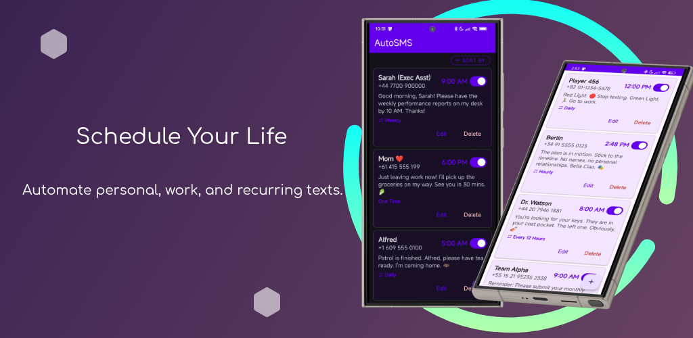
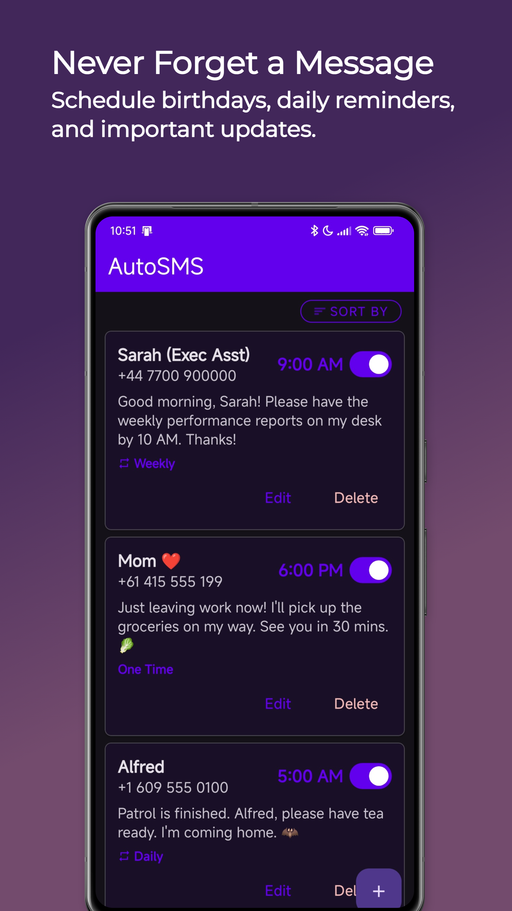
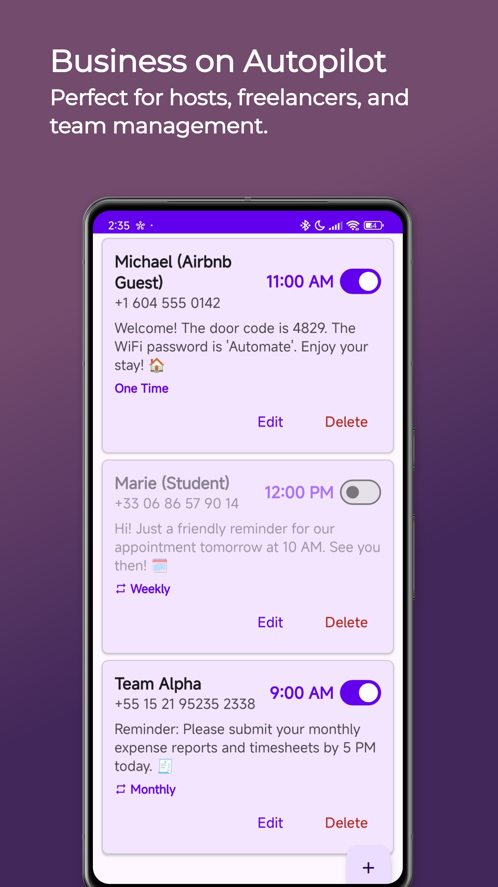
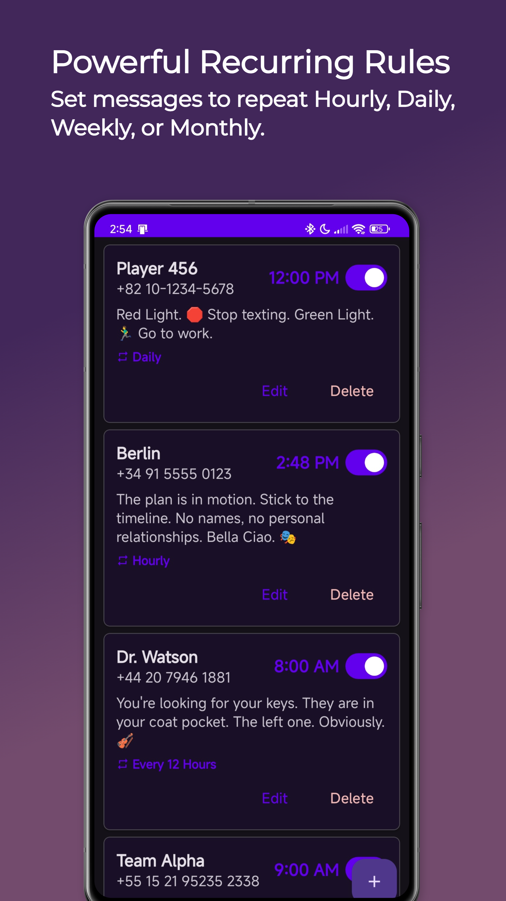
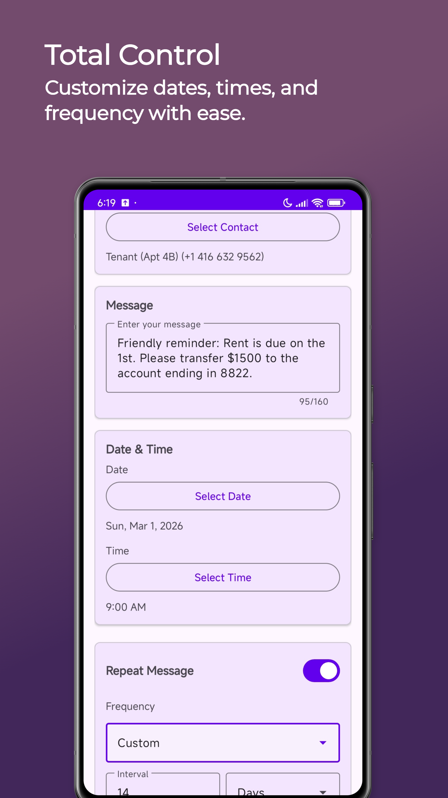

# AutoSMS

Write a text now, send it later. AutoSMS is an Android app that schedules SMS messages for you, birthdays, reminders, recurring check-ins, whatever you need. Set it up once and forget about it. Its very customisable and very reliable. 

## Screenshots

  
  
  
  

## What it does

- Schedule texts to any contact or phone number. 
- Repeat on any interval: hourly, daily, weekly, monthly, or custom (e.g. every 3 days) very reliably!
- Pick contacts from your address book or type a number manually
- Survives reboots. schedules are will keep going automatically when your phone restarts. 
- Choose whether missed messages should still send if your phone was off. 
- Has Dark and light options. Just change your system default. 
- Sorts and filters for managing lots of schedules

## Getting started

Install from [Google Play](https://play.google.com/store/apps/details?id=com.elias.autosms).

## License

Copyright &copy; 2025 Josh Zachariah. All rights reserved.
